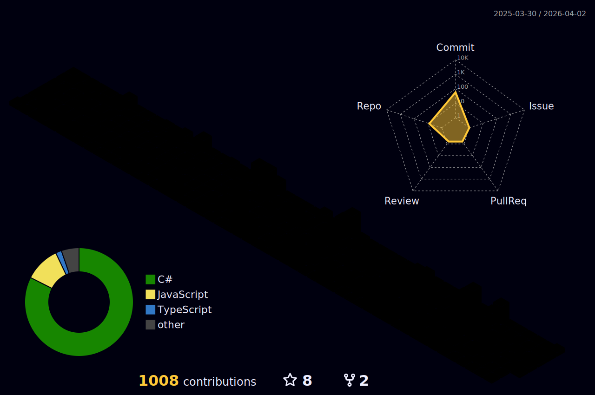

### Saudações ! Seja bem vindo ao meu portfólio de repositórios.

### 💻 Desenvolvedor de Software.
#### 🎓 Profissional nas Stacks tanto no Front-end como Back-end.
#### 👨‍ 💻Todos os meus projetos estão disponiveis no link: [Repositórios GitHub](https://github.com/douglasfdev?tab=repositories)

## Contato

## Stacks & Techs

 

 
 
 

 

### Favorite Stuffs

